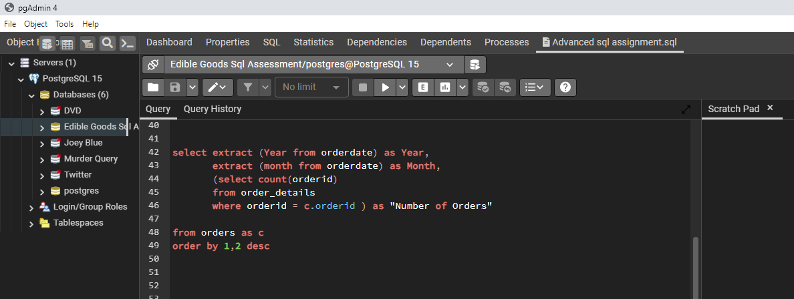
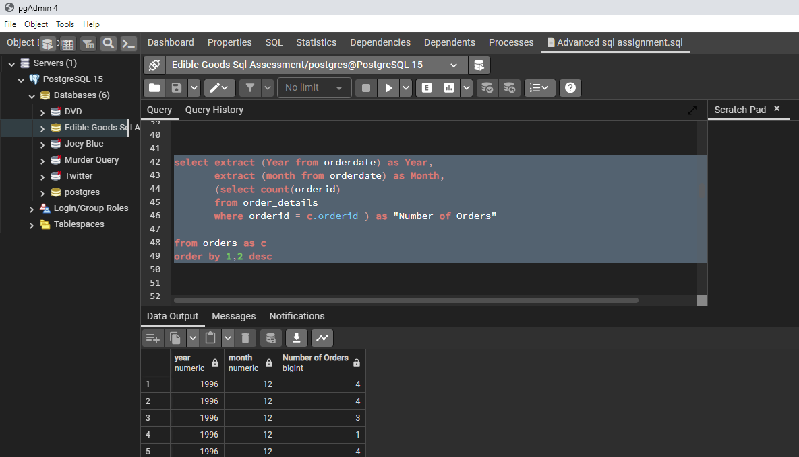
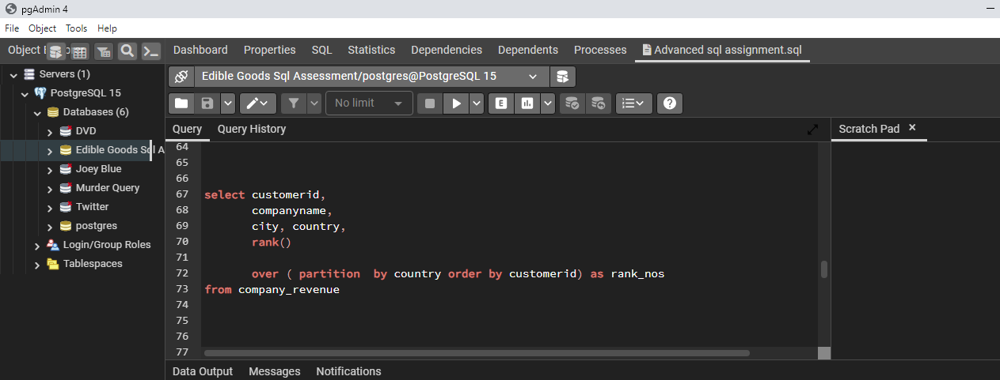
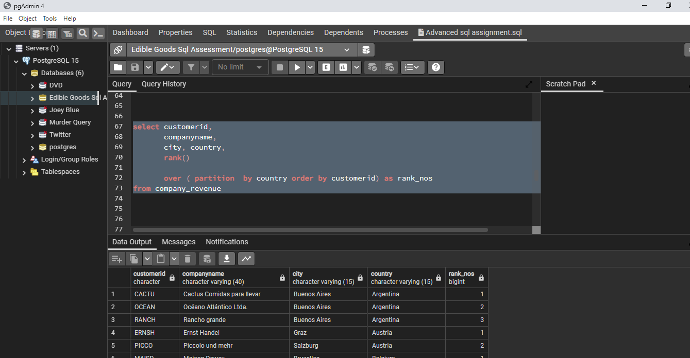
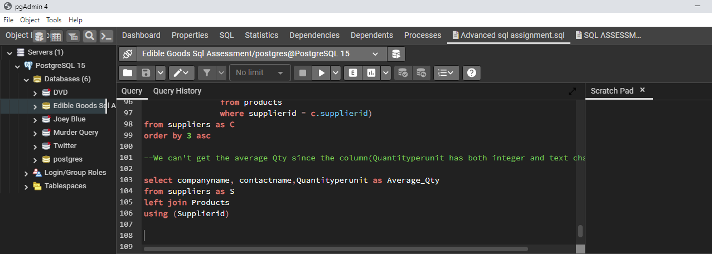
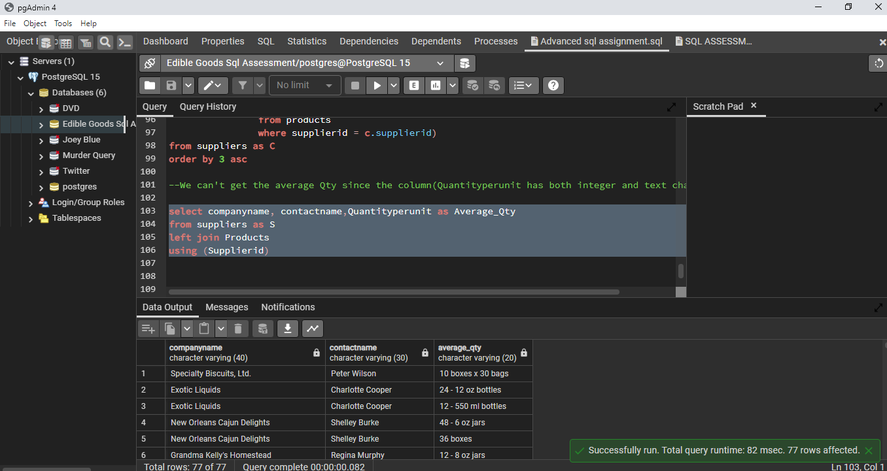

## NorthWind-DataBase

### Introduction

The Northwind Database is for a business entity that deals with edible goods.

Download the DB and restore it to your Postgres software.

You will find the DB and the schema diagram in the assessment folder on the drive.

Using the Northwind Database and schema diagram, You

have been given the responsibility to retrieve the following outputs from the database:

### Business Task

1. The company wants to reward its **Sales Representative staff only**.

   For this to happen, we would need to know the staff name, the total

   amount of money the staff has handled during a customer transaction and

   the department this staff belongs to. (Remember, we want
 
   just the sales rep staff). Please help the Finance department generate a 

   summary table that shows the full name (last + first name  combined),

   the total amount of transactions, and the title of these employees. **Put this output in view.**

2. The board of directors is interested in seeing the volume of transactions

   this business has made. Your mission: In the operation year,

   **give a breakdown of the total number of orders by year and by month.**
   

4. The company is doing well in terms of revenue. The directors are planning to
  
   expand their customer base in some countries. **Generate a ranked table from the customer's

   table that displays the customer ID, company name, city, country, total quantity, and ranked 

   value.** This rank table should be partitioned by country.
   

4. There have been some concerns with some of our suppliers. The management would like to know
  
    the MVP (most valuable player) suppliers and the ones that can be replaced.

   **Return a table that shows the name of the company, the contact’s name, and the average 

   quantity these companies have done for the company.**

### Skills Demonstrated

The following PowerBI features were incorporated

-Subquery

-Joining

-CTE

#### Business Solution:

Question 1 Code            |      Question 1 result
:-------------------------:|:-----------------------:
    |          

Question 2 Code            |      Question 2 result
:-------------------------:|:-----------------------:
    |          

Question 3 Code            |      Question 3 result
:-------------------------:|:-----------------------:
    |          

Question 4 Code            |      Question 4 result
:-------------------------:|:-----------------------:
    |          

